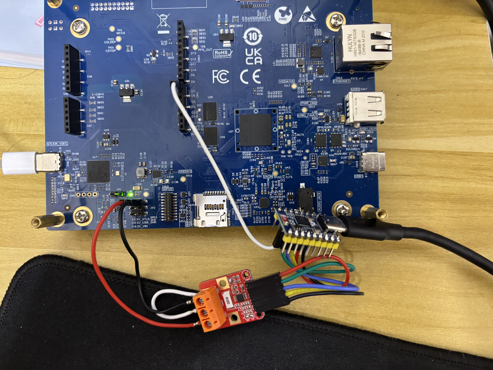

# fyp-power-measure

Power measurement companion for benchmarking on the STM32N6570-DK with ST Edge AI.

This project measures power consumption during NPU inference using an INA228 power monitor connected to an ESP32-C6, then streams protobuf-encoded samples to the host benchmark runner.

## Overview

This repository includes:

- **Arduino firmware**: `fyp-power-measure.ino`
- **Protobuf schema and generated sources** for serial power samples:
  - `power_sample.proto`
  - `power_sample.pb.*`
- **ST Edge AI patch helper script**: `patch_stedgeai_power.py`
- **Patch snippets and documentation** under `patch/`

When the ST Edge AI patch is applied, the host benchmark derives `pm_avg_inf_mW` (and related `pm_avg_*` CSV fields) only from samples collected while inference is active.

## Requirements

- **STM32N6570-DK** target board
- **ESP32-C6** connected to an **INA228** power monitor
- **ST Edge AI** installed
- `STEDGEAI_CORE_DIR` set in the environment

## 1. Patch ST Edge AI

After installing or upgrading ST Edge AI, patch the validation sources:

```bash
python3 patch_stedgeai_power.py
```

The patch script is idempotent and updates both files when they are present:

- `aiValidation_ATON.c`
- `aiValidation_ATON_ST_AI.c`

The patch:

- adds sync GPIO helpers
- wraps `npu_run()`
- marks inference windows on a GPIO pin

Default sync pin on the STM32N6570-DK: **D7 on CN11 (PD6)**

For full patch details, see:

- [`patch/power-measure-patch-stedge-ai.md`](patch/power-measure-patch-stedge-ai.md)

If ST Edge AI is reinstalled or upgraded, run the patch script again.

## 2. Flash the Arduino Firmware

Flash `fyp-power-measure.ino` to the ESP32-C6.

The firmware:

- uses interrupt-driven sync edge detection
- reads INA228 energy and power data
- sends binary protobuf `PowerSample` frames over serial at **921600 baud** by default

## Wiring

Connect the STM32 sync GPIO to the ESP32 inference input pin and share ground:

- **STM32 sync GPIO**: default **D7 on CN11 (PD6)**
- **ESP32-C6 `IS_INFERENCING_PIN`**: **GPIO 3**


